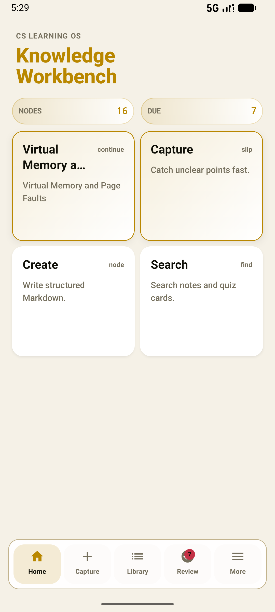
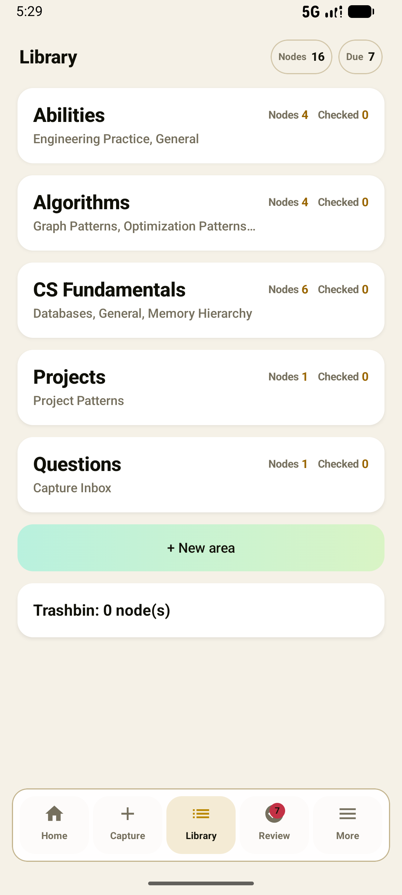

# CS Learning OS Android 使用说明

## 开始使用

安装并打开 `CS Learning OS` 后，内置学习内容会在本机初始化。笔记、题卡、复习记录、随手记和备份都保存在设备的本地 Room 数据库中。没有账号要求，也不需要连接桌面端或服务器即可完成核心学习流程。

底部导航有五个入口：`首页`、`捕捉`、`知识库`、`复习` 和 `更多`。

## 首页

首页汇总本机的学习进度，并提供继续学习、新建 Markdown 笔记、搜索和进入待复习内容的快捷入口。`NODES` 显示本地知识节点数量，`DUE` 显示待复习题卡数量。

## 捕捉

`捕捉` 用于先保存零散的想法、问题或资料线索。新建 Capture Slip 后，可以继续编辑、归档、恢复或删除它；也可以把它整理为普通笔记草稿。Capture Slip 不会自动变成知识节点，保存仍由你确认。

## 知识库

在 `知识库` 中按 Area 浏览本地笔记。你可以新建 Area，打开节点阅读或编辑，按需要搜索，并将不再需要的节点移到回收站。回收站中的节点可以恢复；永久删除后只能从你此前导出的备份中找回。

创建或编辑笔记时，填写标题、选择 Area，并编辑 Markdown 正文后保存。笔记中的 `:::quiz` 题卡会进入 `复习` 流程。

## 复习

`复习` 显示到期题卡，可按 Area 开始学习。先查看题目并显示答案，再选择 `Again`、`Hard` 或 `Good` 评分；应用会据此更新下一次复习时间。本地复习队列不依赖网络。

## 更多

`更多` 将常用设置分为以下区域：

- `系统`：语言和浅色、深色显示设置。
- `服务`：可选 AI 服务商配置。
- `数据`：导出备份与恢复本地数据。
- `指南`：进入功能说明和学习入口。

在恢复、清理数据或更换设备前，先从 `更多` -> `数据` 导出备份。恢复会替换当前本地数据；导入文件会先经过格式和大小等边界检查，无法通过检查的文件不会写入本地资料。

## AI 使用指南

AI 仅是可选功能。没有配置 AI 时，笔记、捕捉、搜索、复习和备份仍可离线使用。

1. 打开 `更多` -> `服务`，填写供应商、API 密钥、Base URL 和模型。
2. Base URL 必须是带主机名的 HTTPS 地址。保存设置后可使用 `校验` 测试连接，使用 `模型` 拉取可选模型并选择要用的模型。
3. API 密钥仅保存在本机，并使用 Android Keystore 加密保护。应用不接受明文网络连接；如果密钥保护或读取失败，需要重新输入密钥。
4. 在 `捕捉` 中保存一条 Capture Slip，选择生成 AI 草稿后先审阅预检卡；预检卡会列出将发送的 Slip 字段和节点标题上下文。需要时可先点 `校验`，确认后再显式点 `Generate`。AI 只会在你显式发起生成后访问配置的服务商。
5. 生成结果先作为可编辑的 Markdown 草稿打开。检查标题、Area、正文和题卡后，点击 `Save Markdown` 才会写入知识库；关闭、返回或继续编辑都不会让 AI 自动保存内容。

## 知识助理

知识助理可以基于本地学习资料帮助解释概念、整理笔记草稿或规划复习。发送问题时，应用会自动从本地搜索并最多附带 3 条摘录、合计最多 1,200 个字符的上下文；回复会显示引用来源。请避免在问题中输入敏感信息，并结合所配置服务商的隐私政策决定是否发送。AI 回复与建议的放置位置都需要你审阅。助理可生成或更新可编辑草稿，也可按你的操作保存一条 Capture Slip，但不会批量写入笔记、题卡或复习记录。

## 数据与隐私

日常学习数据保留在设备本地。只有你配置并主动使用 AI 时，相关请求才会发送到你选择的 HTTPS 服务商；请根据该服务商的隐私政策决定发送什么内容。当前版本不提供跨设备同步、远程账号、公式阅读器、代码阅读器或批量 AI 写入功能。
