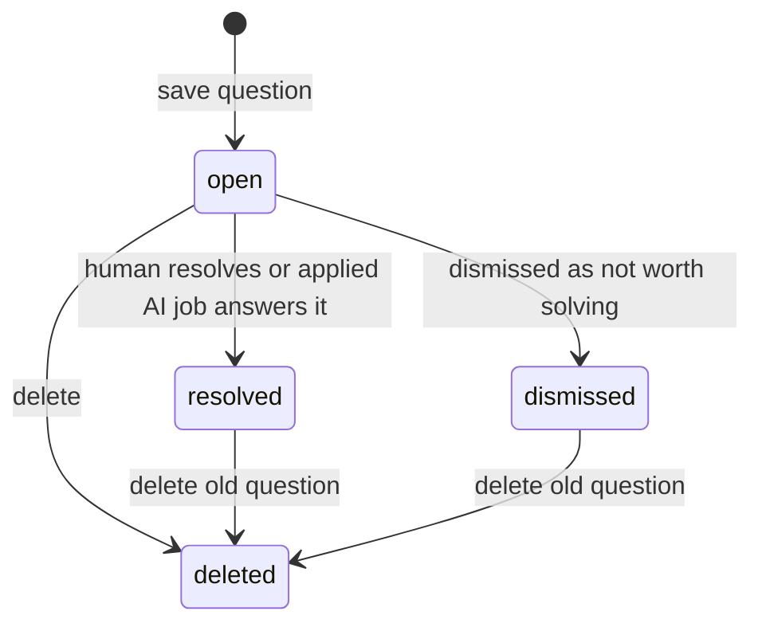
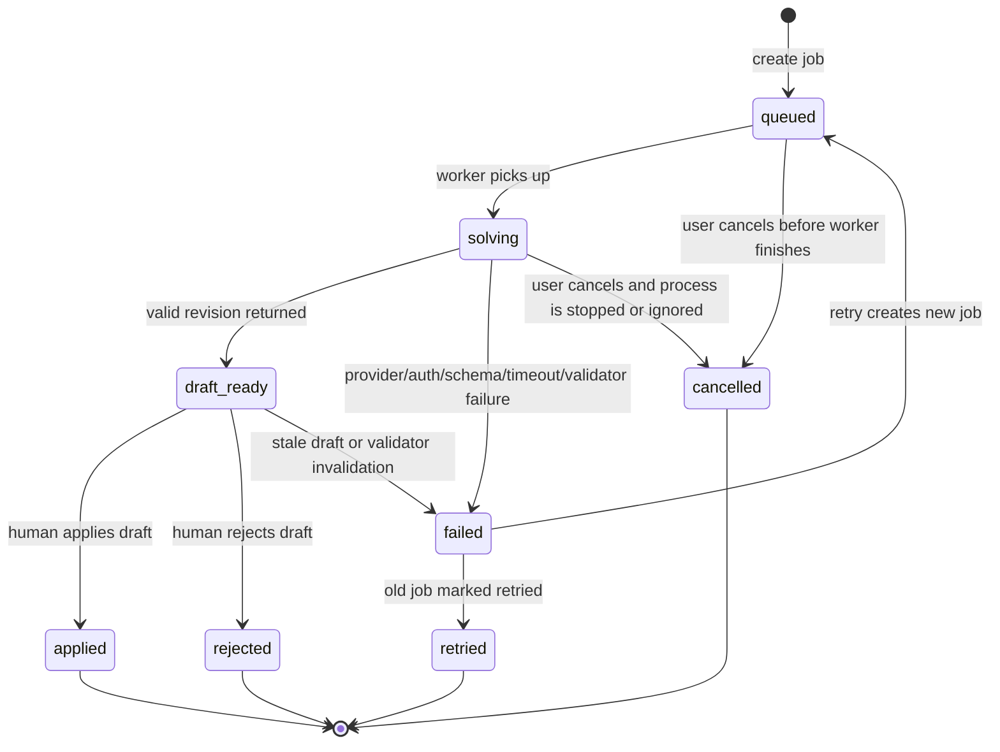
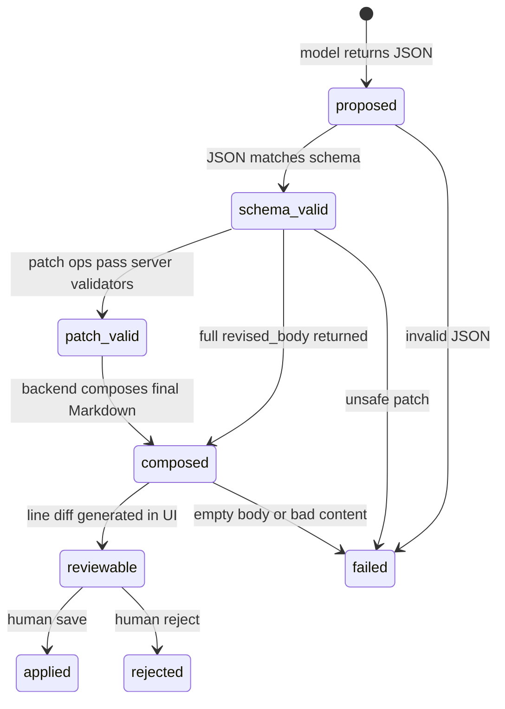
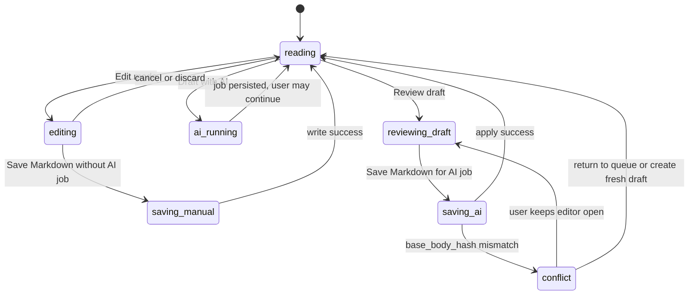

# CS Learning OS State Machine And App-Store Readiness

This document defines the current functional logic and the next engineering guardrails for CS Learning OS. The goal is to move from "vibe coding that works today" to a maintainable local-first learning app that could eventually survive real users, app-store review, and long-term data growth.

## Why This Exists

AI-assisted coding is useful for velocity, but the main risks are not only syntax bugs. The recurring risks reported around vibe coding are:

- Security debt: AI-generated code can look production-ready while missing validation, authorization, dependency checks, or safe defaults.
- Maintainability debt: features are added as isolated patches without a stable state model, making future debugging expensive.
- Hidden product risk: flows work in the happy path but fail silently around cancellation, retries, stale state, partial writes, and background jobs.
- Supply-chain risk: generated code may suggest dependencies or package names without enough verification.
- Ownership gap: the developer may not fully understand code that was accepted because it "felt right."

Project response: treat AI as a drafting assistant, but require deterministic state machines, durable event logs, small patches, validation, smoke tests, and human apply/reject checkpoints.

## Layer Model

### Application Layer

The application layer is the user-facing React app.

Responsibilities:

- Own visible modes: node reading, quiz reading, focus mode, edit mode, Q Queue, AI draft review.
- Make URL route the source of truth for selected node/quiz/queue and focus mode.
- Treat edit mode as transient UI state, not canonical content state.
- Never save AI output automatically.
- Always show user-controllable actions: review, apply, reject, retry, delete, dismiss.
- Show progress and failure states instead of silent background work.
- Prefer stable UI primitives over too many buttons. Example: Q card scope uses a dropdown.

Non-responsibilities:

- Do not decide whether a patch is semantically safe.
- Do not write Markdown files directly.
- Do not resolve reader questions before backend apply succeeds.
- Do not assume an AI job is valid just because it returned JSON.

Current risks:

- The app has growing component complexity in `App.tsx`.
- Q Queue, edit mode, and AI review still share many local states.
- Long lists are not virtualized yet.
- Error display is useful but not yet categorized enough for app-store-grade diagnostics.

Recommended next actions:

- Split `App.tsx` into route shells, queue components, markdown editor, AI job panel, and API client modules.
- Add typed UI state reducers for edit/review/queue flows.
- Add a status banner fed by backend health/preflight.
- Add list virtualization if nodes/quizzes/questions exceed a few hundred visible rows.

## Data Layer

The data layer is local-first.

Canonical stores:

- Markdown files under the configured content directory are the human-editable source of knowledge.
- SQLite `knowledge.db` is the query/index/cache layer.
- SQLite FTS tables power search.
- `reader_questions` stores unresolved or resolved reading questions.
- `ai_jobs` stores durable AI work requests and their outcomes.
- `ai_job_events` stores a timeline for debugging background AI work.
- `generated/codex-home` stores project-local Codex config generated from the user's provider config.

Data ownership rules:

- Private learning content belongs outside the public app repository.
- `knowledge.db` belongs outside Git by default.
- Demo content is tiny and safe to commit.
- Applying an AI draft must update Markdown source and SQLite rows in one backend transaction path.
- Reader questions should stay `open` until a draft is actually applied.

Current risks:

- Full re-ingest is simple but may become expensive as content grows.
- Job/event retention is not yet enforced.
- There is no explicit schema version table.
- There is no automatic backup/snapshot before write.

Recommended next actions:

- Add `schema_meta(version, migrated_at)` for explicit DB migrations.
- Add `content_snapshots` or filesystem backup before write operations.
- Add retention policy for `ai_jobs` and `ai_job_events`: keep two months, always keep abnormal/error jobs until acknowledged.
- Add incremental ingest by file path and mtime/content hash.
- Add indexes for queue views:

```sql
CREATE INDEX IF NOT EXISTS idx_reader_questions_status_created
ON reader_questions(status, created_at DESC);

CREATE INDEX IF NOT EXISTS idx_ai_jobs_status_updated
ON ai_jobs(status, updated_at DESC);

CREATE INDEX IF NOT EXISTS idx_ai_job_events_job_id
ON ai_job_events(job_id, id);
```

## Strategy Layer

The strategy layer contains policy decisions that should be explicit, versioned, and testable.

Current strategies:

- Content Standard A: bilingual practical exam note.
- Content Standard Q: quiz-bank item with prompt, answer, explanation, plain explanation, what this tests, linked review.
- AI provider strategy: default to Codex CLI with dynamic third-party provider config.
- Patch strategy: prefer compact `patch_ops`; compose final body server-side; require human review.
- Safety strategy: reject unsafe replace patches and stale body hashes.
- Q strategy: questions are not resolved until applied.

Needed strategy files or tables:

- `docs/content-standards.md`: standards A/Q and future variants.
- `docs/state-machine.md`: this document.
- Future `docs/ai-policy.md`: model/provider/preflight/token/privacy policy.
- Future `docs/release-checklist.md`: app-store readiness checklist.

Recommended next actions:

- Store content standards in a machine-readable file so prompts can reference `standard_id`.
- Add prompt version to `ai_jobs`.
- Store `policy_version` and `validator_version` on each AI job.
- Add a preflight API that checks Codex CLI, provider base URL, auth file, JSON schema output, and timeout behavior before enabling Draft with AI.

## Reader Question State Machine

Reader questions represent learner uncertainty, not AI work.



Allowed states:

- `open`: visible in Q Queue and eligible for AI drafting.
- `resolved`: answered by human or applied AI draft.
- `dismissed`: intentionally ignored, not counted as unresolved.
- `deleted`: removed from the database.

Historical/legacy states:

- `queued`, `solving`, `draft_ready`, `failed` appeared in earlier designs but should not be the primary question state. Those belong to `ai_jobs`.

Invariants:

- A question must remain `open` while AI jobs are queued, running, failed, draft-ready, rejected, cancelled, or retried.
- A question becomes `resolved` only after the final content has been applied.
- Deleting a question should not delete historical AI jobs unless a retention job explicitly prunes old data.

## AI Job State Machine

AI jobs represent durable background work.



States:

- `queued`: durable row exists, no content changes.
- `solving`: backend worker is building prompt or running model.
- `draft_ready`: revision is valid enough for human review.
- `failed`: no content changes; safe to retry.
- `cancelled`: user asked to stop; no content changes.
- `rejected`: draft was reviewed and rejected; linked questions stay open.
- `applied`: draft was saved to Markdown and SQLite; linked questions resolved.
- `retried`: old failed job has been superseded by a new job.

Invariants:

- Only `draft_ready` can be applied.
- Applying must check `base_body_hash`.
- Applying must write Markdown, update SQLite/FTS, update job status, and resolve linked questions together.
- Failed/cancelled/rejected jobs must not resolve questions.
- Retried jobs must point to their predecessor through `retry_of`.
- Event logs must record each important transition.

Current gaps:

- Cancel does not reliably kill the Codex process tree.
- Timeout handling relies on subprocess timeout but should also clean child processes.
- Jobs can grow indefinitely without retention.
- There is no preflight state separate from job execution.

Recommended next actions:

- Add `preflight` endpoint and UI gate.
- Store external process PID on `ai_jobs` when possible.
- Add process-tree kill on timeout/cancel.
- Add retention and abnormal-job filters.

## AI Draft Patch State Machine

AI output should move through a validation pipeline before it becomes user-visible.



Patch rules:

- Prefer small patches, but not tiny `find` strings that only match a heading.
- `replace` must match the complete old block being replaced.
- `replace` must not keep a duplicate copy of the old block after the new block.
- `append_after` is acceptable for additive clarifications, but not for replacing an existing section.
- `append_end` is acceptable for low-risk additions or smoke tests.
- Full `revised_body` is the fallback when exact patching is unsafe.

Current validators:

- Unsupported patch op is rejected.
- Missing `find` is rejected for `replace` and `append_after`.
- Ambiguous `find` occurrence count is rejected.
- Multi-line replacement with too-small `find` is rejected.
- Replacement that looks like "old text + new content" is rejected.

Recommended next validators:

- Duplicate heading detection inside the changed section.
- Repeated line/block detection above a threshold.
- Markdown heading hierarchy sanity check.
- Code fence balance check.
- Link target existence check.
- Content-standard linting for Standard A and Standard Q.

## Edit Mode State Machine

Edit mode is local UI state.



Invariants:

- User edits should never be lost because a draft fails.
- Link navigation while editing must exit edit mode or confirm discard.
- Focus mode should not hide essential edit/review controls.
- Applying an AI draft should not resolve questions until backend confirms success.

## Route And Navigation State

Routes are part of the state machine.

Canonical routes:

- `/nodes/:slug`
- `/quizzes/:quizId`
- `/quizzes`
- `/queue`

Query state:

- `?focus=1`
- `?area=...`
- `?track=...`
- `?q=...`

Hash state:

- `#section-...` for Markdown table-of-contents anchors.

Rules:

- Browser back should restore selected node/quiz and section hash.
- Link navigation should reset detail scroll to top when no section hash is present.
- Stale section hashes should not move the next page to the wrong location.

## Performance Plan

Current performance profile:

- Markdown files are small enough for full ingest.
- SQLite search is appropriate for local-first usage.
- React renders all visible cards directly.
- AI prompt currently sends full body in many cases.

Near-term optimizations:

- Incremental ingest by file hash or modified time.
- Add queue indexes listed in the data layer section.
- Only fetch detail bodies when needed.
- Split bundle into route-level chunks if the UI grows.
- Limit Q Queue results to recent/abnormal by default.
- Add `limit` and `cursor` query params for jobs/questions.

AI/token optimizations:

- Build prompts from selected section + surrounding headings + linked-node summaries when possible.
- Include full body only when the patch spans multiple sections or validation needs it.
- Store prompt/context hash to avoid rerunning identical jobs.
- Store model output size, latency, and validator outcome for future tuning.

Scale thresholds:

- At 100 nodes: current design is fine.
- At 1,000 nodes: incremental ingest, pagination, and route-level code splitting become important.
- At 10,000 nodes: background indexing, virtualized lists, and stricter FTS/query profiling become mandatory.

## App-Store Readiness

This project is currently a local developer app, not app-store ready.

Required before app-store-style distribution:

- Clear local data policy: where content, DB, logs, and generated Codex config live.
- No private content in app bundle.
- No secrets in Git, logs, screenshots, or crash reports.
- Explicit user consent before sending content to third-party AI providers.
- Provider configuration screen with test/preflight button.
- Offline/read-only mode that works without AI.
- Backup/restore/export/import.
- Crash-safe writes with snapshots.
- Accessibility pass for keyboard navigation, focus indicators, color contrast, and screen-reader labels.
- Privacy policy explaining local storage and AI-provider transmission.
- Dependency/license inventory.
- Automated build/test/release checklist.

Recommended release gates:

- All smoke tests pass.
- No open `failed` jobs from release smoke.
- `Codex preflight` passes or AI is disabled.
- Search works on clean demo data and private data.
- App can start with empty content directory.
- App can recover from corrupt DB by re-ingesting Markdown.

## Vibe-Coding Risk Controls For This Project

Risk controls already present:

- Human review before applying AI drafts.
- Durable Q Queue and job events.
- Dynamic Codex provider config instead of hardcoded official API assumptions.
- `base_body_hash` stale draft protection.
- Patch validation for unsafe replace behavior.
- Smoke tests for Q Queue and fake AI draft flow.

Risk controls still needed:

- Real Codex preflight endpoint.
- Process-tree kill on cancel/timeout.
- Security linting and dependency audit in CI.
- Content-standard lint.
- Incremental ingest and backup before writes.
- Release checklist and privacy policy.

## Source Notes On Vibe-Coding Risks

The risk model above is informed by recurring concerns across current writing and research on AI-generated code:

- Kaspersky: security risks from coding assistants, prompt injection, and agent memory/tooling exposure.
- TechTarget: vibe-coding mitigation through static/dynamic analysis and dependency scanning.
- Twilio: vibe coding is risky beyond prototypes without oversight because of complexity, maintainability, security, and accuracy issues.
- TechRadar/Veracode reporting: large shares of AI-generated code can contain security flaws despite looking production-ready.
- Academic/security discussions: agent-generated code can be functionally correct while failing security requirements.

Practical conclusion: use AI to draft, but make deterministic state, validation, tests, review, and data ownership the real product architecture.
