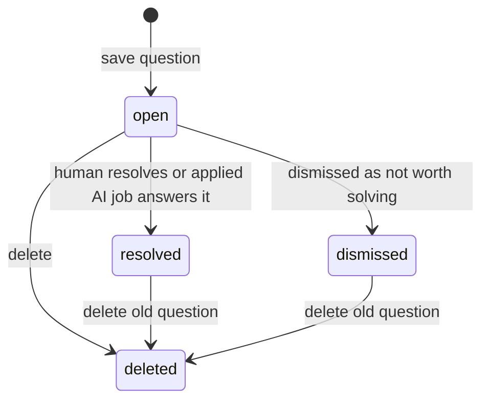
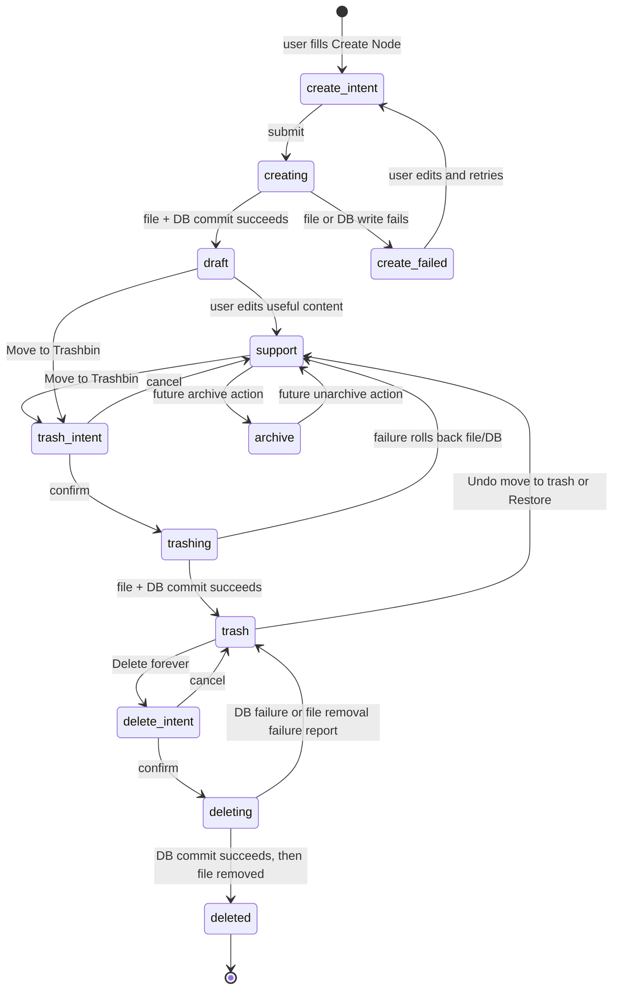
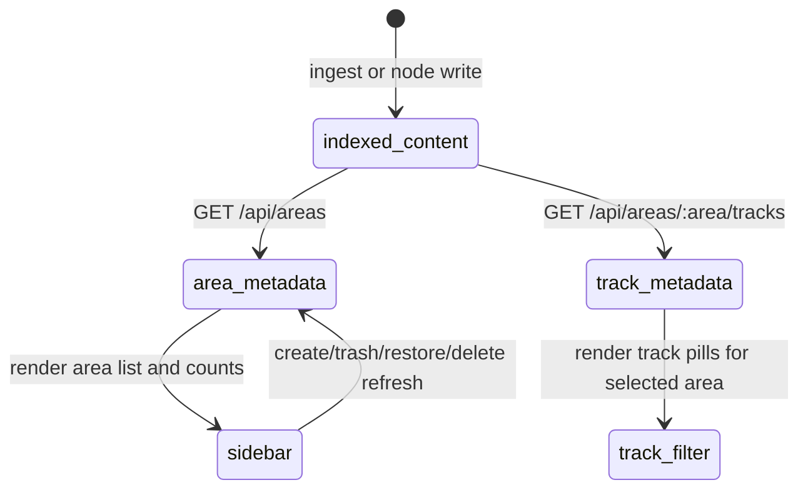
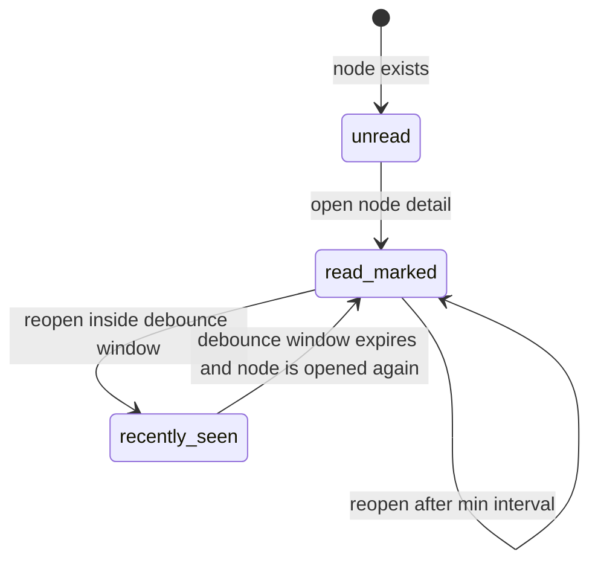
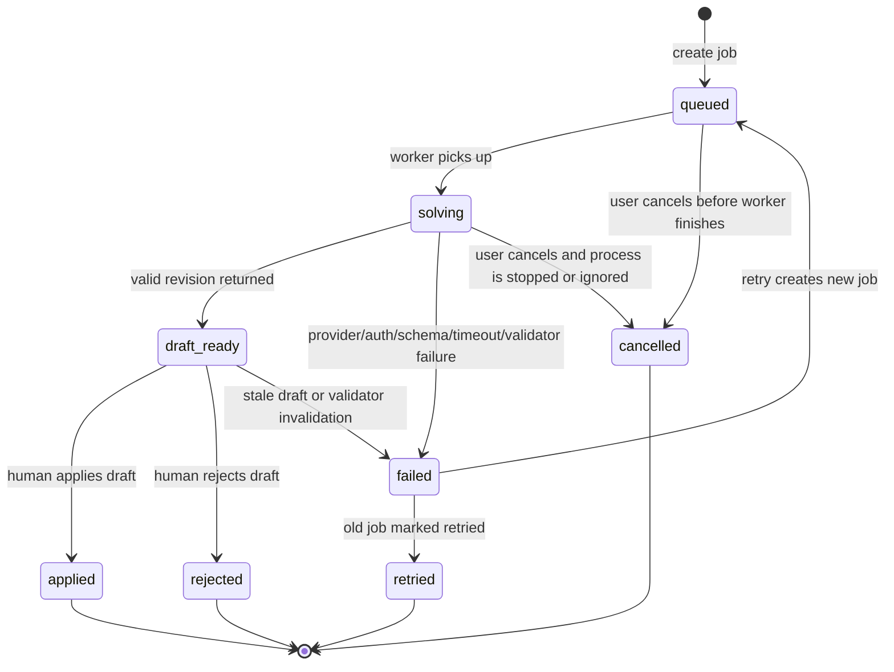
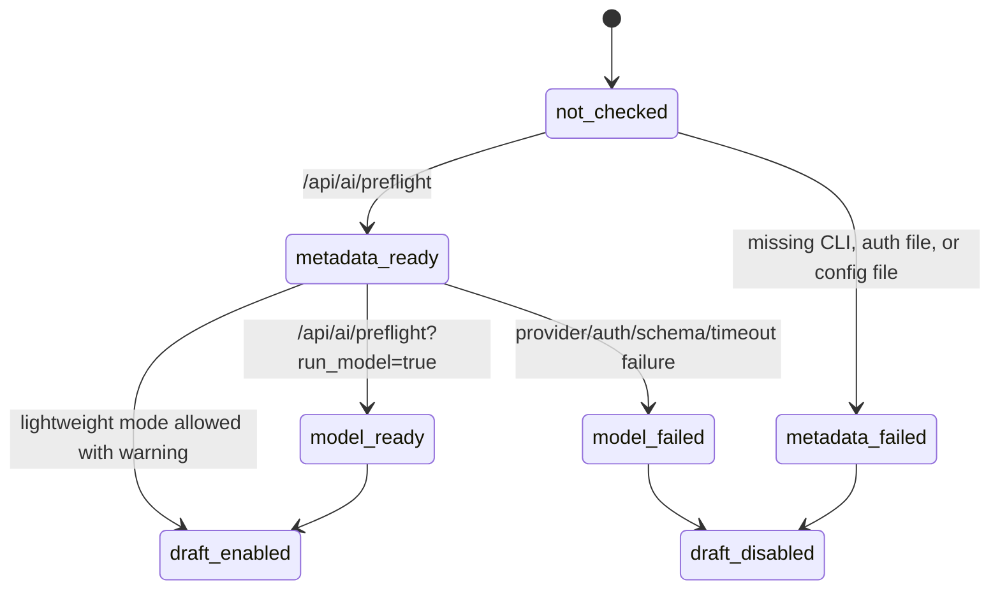
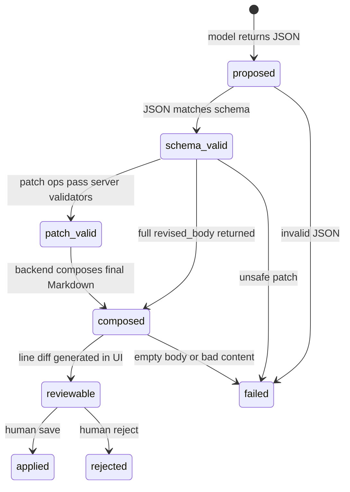
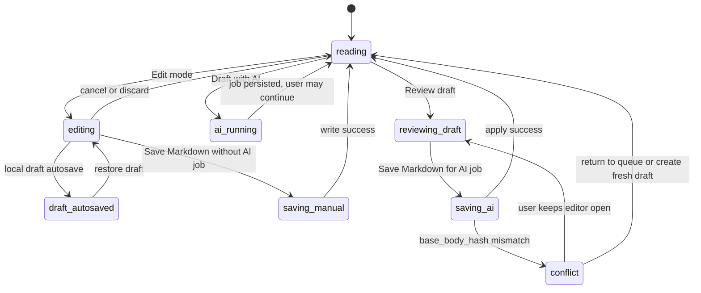
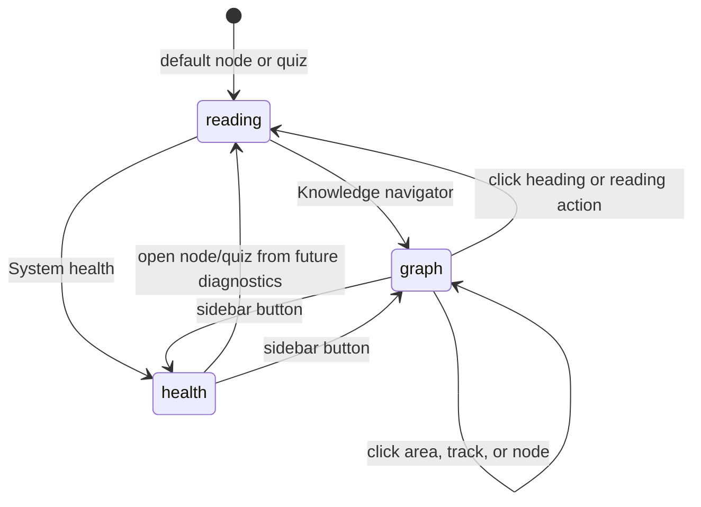
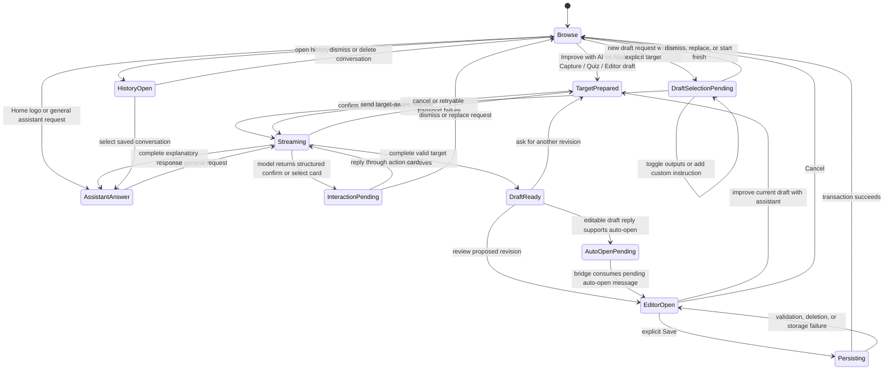

# CS Learning OS State Machine And App-Store Readiness

This document defines the current functional logic and the next engineering guardrails for CS Learning OS. The goal is to move from "vibe coding that works today" to a maintainable local-first learning app that could eventually survive real users, app-store review, and long-term data growth.

## Why This Exists

AI-assisted coding is useful for velocity, but the main risks are not only syntax bugs. The recurring risks reported around vibe coding are:

- Security debt: AI-generated code can look production-ready while missing validation, authorization, dependency checks, or safe defaults.
- Maintainability debt: features are added as isolated patches without a stable state model, making future debugging expensive.
- Hidden product risk: flows work in the happy path but fail silently around cancellation, retries, stale state, partial writes, and background jobs.
- Supply-chain risk: generated code may suggest dependencies or package names without enough verification.
- Ownership gap: the developer may not fully understand code that was accepted because it "felt right."

Project response: treat AI as a drafting assistant, but require deterministic state machines, durable event logs, small patches, validation, smoke tests, and human apply/reject checkpoints.

## Layer Model

### Application Layer

The application layer is the user-facing React app.

Responsibilities:

- Own visible modes: node reading, quiz reading, focus mode, edit mode, Q Queue, AI draft review, knowledge graph, and program health.
- Make URL route the source of truth for selected node/quiz/queue and focus mode.
- Treat edit mode as a protected workflow: explicit Save is the only canonical write, while local draft autosave prevents losing in-progress intent.
- Keep local drafts, AI drafts, and canonical Markdown separated until the user explicitly applies or saves.
- Never save AI output automatically.
- Always show user-controllable actions: review, apply, reject, retry, delete, dismiss.
- Show progress and failure states instead of silent background work.
- Prefer stable UI primitives over too many buttons. Example: Q card scope uses a dropdown.

Non-responsibilities:

- Do not decide whether a patch is semantically safe.
- Do not write Markdown files directly.
- Do not resolve reader questions before backend apply succeeds.
- Do not assume an AI job is valid just because it returned JSON.

Current risks:

- The app has growing component complexity in `App.tsx`.
- Q Queue, edit mode, and AI review still share many local states.
- Long lists are not virtualized yet.
- Error display is useful but not yet categorized enough for app-store-grade diagnostics.

Recommended next actions:

- Evolve frontend state around explicit owners: `ReaderWorkflow`, `EditorWorkflow`, `AIJobWorkflow`, `GraphWorkflow`, `LibraryWorkflow`, and `HealthWorkflow`.
- Start that split with typed reducers, context providers, and hooks before introducing heavier state libraries.
- Split `App.tsx` into route shells, queue components, markdown editor, AI job panel, and API client modules.
- Add typed UI state reducers for edit/review/queue flows.
- Continue expanding `/health` into a status cockpit fed by backend health, metrics, and AI preflight.
- Add list virtualization if nodes/quizzes/questions exceed a few hundred visible rows.

## Data Layer

The data layer is local-first.

Canonical stores:

- Markdown files under the configured content directory are the human-editable learning package/projection for content portability, manual inspection, and import/export.
- SQLite `knowledge.db` and the domain store are the long-term operational authority for product state, write coordination, query/index/cache state, and repair status.
- SQLite FTS tables power search.
- `reader_questions` stores unresolved or resolved reading questions.
- `ai_jobs` stores durable AI work requests and their outcomes.
- `ai_job_events` stores a timeline for debugging background AI work.
- `node_activity` stores durable per-node reading traces such as `last_read_at` and `read_count`.
- `/api/areas` is the stable metadata source for sidebar areas and counts.
- `generated/codex-home` stores project-local Codex config generated from the user's provider config.

Data ownership rules:

- Private learning content belongs outside the public app repository.
- `knowledge.db` belongs outside Git by default.
- Demo content is tiny and safe to commit.
- Applying an AI draft must update Markdown source and SQLite rows in one backend transaction path.
- All body writes, including manual Save and AI apply, must go through a shared `ContentWriteService` path so hash checks, snapshots, DB updates, FTS refresh, graph invalidation, and question resolution stay consistent.
- Reader questions should stay `open` until a draft is actually applied.
- Node creation, trash, restore, and permanent delete must go through backend APIs so Markdown files, SQLite rows, FTS, graph cache, and area metadata stay aligned.
- Reading activity is app data, not Markdown content. It belongs in SQLite so future spaced repetition and review scheduling can use it.

Transaction and compensation rules:

- SQLite transactions protect database mutations only; Markdown file writes need explicit compensation.
- For body edits, AI apply, create, trash, and restore, the backend snapshots the original file text before writing. If DB mutation or commit fails, it restores the original file text.
- Body writes must compare the caller's base hash or version against the current indexed content before writing; conflicts return a reviewable conflict response instead of overwriting.
- For create, failure removes the newly created file if it did not exist before.
- For permanent delete, first move the Markdown file into a local staging trash, then commit SQLite deletion, then remove the staged file. If DB commit fails, move the file back.
- No frontend state should assume success until the backend returns the updated object or `{ ok: true }`.

Current risks:

- Full re-ingest is simple but may become expensive as content grows.
- The current area metadata endpoint is count-based and simple; future versions may need ordering, hidden areas, and user-pinned areas.
- Filesystem operations are still not truly atomic across crashes or power loss; robust snapshots and repair tooling are still needed.
- Job/event retention is not yet enforced.
- There is no explicit schema version table.
- There is no automatic backup/snapshot before write.

Recommended next actions:

- Add `schema_meta(version, migrated_at)` for explicit DB migrations.
- Add `content_snapshots` or filesystem backup before write operations.
- Add retention policy for `ai_jobs` and `ai_job_events`: keep two months, always keep abnormal/error jobs until acknowledged.
- Replace full re-ingest as the default path with an incremental derived-index pipeline: content hash/version changes enqueue invalidation work, then FTS, graph cache, media metadata, and area counts refresh from that queue.
- Add incremental ingest by file path and mtime/content hash.
- Add indexes for queue views:

```sql
CREATE INDEX IF NOT EXISTS idx_reader_questions_status_created
ON reader_questions(status, created_at DESC);

CREATE INDEX IF NOT EXISTS idx_ai_jobs_status_updated
ON ai_jobs(status, updated_at DESC);

CREATE INDEX IF NOT EXISTS idx_ai_job_events_job_id
ON ai_job_events(job_id, id);
```

## Strategy Layer

The strategy layer contains policy decisions that should be explicit, versioned, and testable.

Current strategies:

- Content Standard A: bilingual practical exam note.
- Content Standard Q: quiz-bank item with prompt, answer, explanation, plain explanation, what this tests, linked review.
- AI provider strategy: default to Codex CLI with dynamic third-party provider config, but keep providers as adapters behind the durable AI job state machine.
- Patch strategy: prefer compact `patch_ops`; compose final body server-side; require human review.
- Safety strategy: reject unsafe replace patches and stale body hashes.
- Q strategy: questions are not resolved until applied.
- Learning scheduler strategy: use a simple Anki-like spaced repetition loop as the main review scheduler; avoid adding FSRS, semantic scheduling, or ML ranking until basic review events and outcomes prove insufficient.

Needed strategy files or tables:

- `docs/content-standards.md`: standards A/Q and future variants.
- `docs/state-machine.md`: this document.
- Future `docs/ai-policy.md`: model/provider/preflight/token/privacy policy.
- Future `docs/release-checklist.md`: app-store readiness checklist.

Recommended next actions:

- Store content standards in a machine-readable file so prompts can reference `standard_id`.
- Add prompt version to `ai_jobs`.
- Store `policy_version` and `validator_version` on each AI job.
- Add a preflight API that checks Codex CLI, provider base URL, auth file, JSON schema output, and timeout behavior before enabling Draft with AI.

## Reader Question State Machine

Reader questions represent learner uncertainty, not AI work.



Allowed states:

- `open`: visible in Q Queue and eligible for AI drafting.
- `resolved`: answered by human or applied AI draft.
- `dismissed`: intentionally ignored, not counted as unresolved.
- `deleted`: removed from the database.

Historical/legacy states:

- `queued`, `solving`, `draft_ready`, `failed` appeared in earlier designs but should not be the primary question state. Those belong to `ai_jobs`.

Invariants:

- A question must remain `open` while AI jobs are queued, running, failed, draft-ready, rejected, cancelled, or retried.
- A question becomes `resolved` only after the final content has been applied.
- Deleting a question should not delete historical AI jobs unless a retention job explicitly prunes old data.

## Node Lifecycle State Machine

Nodes are canonical Markdown files indexed into SQLite.



Current implementation:

- `POST /api/nodes` creates a Markdown file under `<active-content-root>/nodes/:area/:slug.md`, writes frontmatter, indexes SQLite, FTS, tags, links, and sources.
- The browser form accepts normal text for area, track, and tags, but saves slug values such as `Network Programming` -> `network-programming`.
- `POST /api/nodes/:slug/trash` changes frontmatter `visibility` to `trash` and re-indexes the file.
- `POST /api/nodes/:slug/restore` changes `visibility` back to `support`.
- `DELETE /api/nodes/:slug` is allowed only from `trash`; it deletes the Markdown file and dependent SQLite rows.
- Node body updates use backend write paths only; the React app never writes Markdown files directly.
- File writes are guarded with a compensation step: if SQLite update or commit fails after a Markdown write, the backend restores the previous file contents.
- Permanent delete commits SQLite deletion before removing the Markdown file, so a DB failure does not orphan content by deleting the source first.
- Moving to Trashbin shows an `Undo move to trash` action; Trashbin restore remains the longer-lived cancellation path.
- Moving to Trashbin stores `previous_visibility` in frontmatter so restore can return to `draft`, `support`, or `core` instead of always becoming `support`.

Invariants:

- `visibility = trash` hides the node from ordinary search, graph, and area flows but keeps it visible in Trashbin.
- Permanent delete must be explicit and irreversible from the UI.
- After create, trash, restore, or delete, the frontend must refresh area metadata so sidebar counts do not drift.
- FTS rows and graph cache must be invalidated whenever node content or visibility changes.
- Cancel means no durable state change. Undo/restore means a new durable state change back to `support`.
- A failed write must either leave both Markdown and SQLite unchanged or return a visible error.
- If a filesystem delete fails after DB commit, the backend must report the error; future cleanup tooling should reconcile orphaned files.
- Restore/Undo should return the UI to readable node detail, not leave the user in a stale edit session from the trashed state.
- Derived UI counters such as `open_question_count` must be updated whenever questions are saved, dismissed, deleted, resolved, or resolved by AI apply.

## Area And Track Metadata State

Areas and tracks are not a hardcoded frontend taxonomy. They are derived from indexed content.



Rules:

- `/api/areas` is the source of truth for sidebar area names and counts.
- `all`, `archive`, and `trash` are system views, not content areas.
- Unknown areas should be displayed with a humanized slug label, not hidden.
- New areas created from the browser must appear without editing React code.
- Track pills are scoped to the active content area and should not appear for `all`, `archive`, or `trash`.

Current limitation:

- Area ordering is currently based on first node order plus slug fallback. Future user-pinned order should live in a metadata table rather than in React constants.

## Reading Activity State Machine

Reading activity is durable app metadata used for future review scheduling.



Current implementation:

- Opening a node detail calls `POST /api/nodes/:slug/read`.
- The backend stores `last_read_at`, `read_count`, and activity `updated_at` in `node_activity`.
- The frontend records reads only in Focus reading mode after a short dwell time, so ordinary clicking/browsing is not treated as review.
- The frontend sends `min_interval_seconds` so StrictMode, refreshes, or quick back-and-forth navigation do not inflate `read_count`.
- `last_read_at` does not update inside the debounce window; it should represent the latest effective reading exposure, not every click.
- `last_read_at` is monotonic. Older client-provided timestamps must not move the stored read time backwards or increment `read_count`.
- The detail page displays `Last read`, `Last edit`, and `Read count` in `Reading trace`.

Future review rules:

- Spaced repetition should use `node_activity` plus quiz outcomes, not Markdown timestamps alone.
- `last_read_at` is not the same as mastery. It is only an exposure signal.
- Future scheduling should store review events separately once answers, confidence, and weights exist.
- The release-track scheduler should stay Anki-like: due date, interval, ease/confidence, lapses, and recent quiz/read evidence are enough for the first durable learning loop.
- FSRS, semantic similarity, embeddings, and ML ranking are explicitly out of scope until the simple scheduler has real outcome data and visible failure modes.

## AI Job State Machine

AI jobs represent durable background work. The durable state machine owns lifecycle, retries, cancellation, validation, and apply readiness; model providers are adapters that can fail without changing content.



States:

- `queued`: durable row exists, no content changes.
- `solving`: backend worker is building prompt or running model.
- `draft_ready`: revision is valid enough for human review.
- `failed`: no content changes; safe to retry.
- `cancelled`: user asked to stop; no content changes.
- `rejected`: draft was reviewed and rejected; linked questions stay open.
- `applied`: draft was saved to Markdown and SQLite; linked questions resolved.
- `retried`: old failed job has been superseded by a new job.

Invariants:

- Only `draft_ready` can be applied.
- Applying must check `base_body_hash`.
- Applying must go through `ContentWriteService`, check the current content version/hash, write Markdown, update SQLite/FTS, update job status, and resolve linked questions together.
- Provider adapters may create candidate output only; they must not write Markdown, resolve questions, or mark jobs applied.
- Failed/cancelled/rejected jobs must not resolve questions.
- Retried jobs must point to their predecessor through `retry_of`.
- Event logs must record each important transition.

Current gaps:

- Cancel does not reliably kill the Codex process tree.
- Timeout handling relies on subprocess timeout but should also clean child processes.
- Jobs can grow indefinitely without retention.
- There is no preflight state separate from job execution.

Recommended next actions:

- Add UI gate for the existing `preflight` endpoint.
- Store external process PID on `ai_jobs` when possible.
- Add process-tree kill on timeout/cancel.
- Add retention and abnormal-job filters.

## AI Provider Preflight State Machine

Preflight is separate from AI job execution. It exists to fail fast before a user spends time waiting on a draft.



Preflight modes:

- Lightweight metadata check: verifies Codex CLI path, generated Codex HOME, copied auth file, generated config file, provider name, model, and base URL.
- Real model check: performs a tiny JSON-schema Codex call and confirms structured output.

Rules:

- Lightweight preflight must not spend model tokens.
- Real model preflight should be user-triggered or release-gate-triggered.
- Draft jobs should record provider/model/config context so failures can be traced.
- UI should show preflight status before or near `Draft with AI`.

## AI Draft Patch State Machine

AI output should move through a validation pipeline before it becomes user-visible.



Patch rules:

- AI apply must be patch/review-first. Silent overwrite is not allowed, even when the model returns a full `revised_body`.
- Prefer small patches, but not tiny `find` strings that only match a heading.
- `replace` must match the complete old block being replaced.
- `replace` must not keep a duplicate copy of the old block after the new block.
- `append_after` is acceptable for additive clarifications, but not for replacing an existing section.
- `append_end` is acceptable for low-risk additions or smoke tests.
- Full `revised_body` is the fallback when exact patching is unsafe, but it still becomes a reviewable diff and must pass version conflict checks before apply.

Current validators:

- Unsupported patch op is rejected.
- Missing `find` is rejected for `replace` and `append_after`.
- Ambiguous `find` occurrence count is rejected.
- Multi-line replacement with too-small `find` is rejected.
- Replacement that looks like "old text + new content" is rejected.

Recommended next validators:

- Duplicate heading detection inside the changed section.
- Repeated line/block detection above a threshold.
- Markdown heading hierarchy sanity check.
- Code fence balance check.
- Link target existence check.
- Content-standard linting for Standard A and Standard Q.

## Edit Mode State Machine

Edit mode is local UI state, but it is a protected workflow rather than a disposable toggle.



Invariants:

- Manual edits require explicit Save before they become canonical content.
- Local draft autosave must preserve editing intent across refresh, node switching, failed saves, and AI job failure.
- Local drafts are separate from canonical Markdown and from AI drafts; saving one must not silently replace another.
- User edits should never be lost because a draft fails.
- Link navigation while editing must restore the relevant local draft, exit edit mode only after explicit discard, or confirm the transition.
- Focus mode should not hide essential edit/review controls.
- Applying an AI draft should not resolve questions until backend confirms success.
- Version conflicts keep the user's draft/review open and show the current canonical content instead of overwriting either side.

## Route And Navigation State

Routes are part of the state machine.

Canonical routes:

- `/nodes/:slug`
- `/quizzes/:quizId`
- `/quizzes`
- `/queue`
- `/graph`
- `/health`

Query state:

- `?focus=1`
- `?area=...`
- `?track=...`
- `?q=...`

Hash state:

- `#section-...` for Markdown table-of-contents anchors.

Rules:

- Browser back should restore selected node/quiz and section hash.
- Link navigation should reset detail scroll to top when no section hash is present.
- Stale section hashes should not move the next page to the wrong location.
- Graph and health are standalone cockpit routes; they should not inherit stale node hashes or focus-mode state.
- Area and track query params should filter visible cards but should not hide a newly created node immediately after create; create navigation must use the new node's area and track.
- `Network Programming`-style user input should be normalized before persistence, while UI labels should remain human-readable.
- Android Assistant top-level entry preserves the active conversation by default.
- Android Assistant fresh-entry callers must opt in explicitly; they may clear the conversation only before the Assistant screen is shown.
- Returning from an editor or reader into Android Assistant should preserve the active conversation unless the caller is an explicit fresh-entry flow.

## Current Loop Cockpit State

The `Current loop` sidebar section is the expansion point for app-level views that are not single knowledge nodes.



Current implementation:

- `/graph` reads backend graph payloads and renders a full-width 2.5D navigator.
- `/graph/area/:area`, `/graph/track/:area/:track`, and `/graph/node/:slug` are canonical layered graph routes.
- Graph endpoint payloads include `path`, `center`, `children`, `pagination`, and `actions`.
- `graph_cache` stores generated payload JSON by route/page key; ingest clears it.
- `/health` reads `/api/system/metrics` and shows content size, SQLite size, generated artifacts, queue counts, and AI readiness.
- `/health` is a cockpit mode, not a node-reading mode: the search input is hidden, the center column is a storage ledger, and sidebar/ledger/dashboard panes scroll independently.
- Both routes are deliberately dependency-light.

Future graph rules:

- Graph defaults to viewport/ego-network loading around the current route, area, track, or selected node; it must not load the entire knowledge graph by default.
- Lazy-load WebGL or Three.js only when `/graph` is opened.
- Build graph edges from links, tags, prerequisites, review history, and embeddings rather than hardcoded UI arrays.
- Keep click-through to canonical `/nodes/:slug` and `/quizzes/:quizId`.
- Keep node and heading layers paginated at 12 visible cards unless user testing proves more is still readable.
- Use cursor/page keys for graph expansion so memory grows with the visible neighborhood, not total content size.

Future health rules:

- Health metrics must never leak secrets or private Markdown body text.
- Health should prefer counts, sizes, timestamps, hashes, and status summaries.
- Health should flag actionable states: stale index, large generated artifacts, failed jobs, missing provider config, and backup age.
- Heavy health diagnostics must not block first paint. Storage totals and deep partition scans use a cached snapshot with a background refresh path.
- On API startup, the backend loads the previous health snapshot into memory and starts one daemon refresh thread. `/health` reads the last available snapshot and labels the Beijing-time update timestamp.
- Opening `/health` should not be the first trigger for a heavy scan. Manual refresh may still call `/api/system/metrics?refresh=true`.
- If `/health` receives `cache.refreshing=true`, the frontend polls `/api/system/metrics` every 4 seconds and stops once the refreshed snapshot is available.
- GitHub upload size defaults to local tracked-file estimates. Remote GitHub API checks are opt-in through `CS_LEARNING_GITHUB_REMOTE_SIZE=1` to avoid rate limits and network stalls.
- `/api/system/metrics` returns real-time DB counts plus cached heavy metrics. If no snapshot exists, it returns a lightweight fallback immediately and records `cache.refreshing=true`.

## Android Object-Aware Assistant Editing State

This state machine governs Android assistant edits for Nodes, Capture slips, and Review quizzes. It is the release contract for any feature that changes assistant behavior. A model response is never a persistence operation.

### Motion And Narrow Layout Policy

- Press feedback uses 110ms, visual state changes use 130ms, disclosures use 170ms, and route or drawer movement uses 210ms.
- Streaming replies stay aligned with the latest message using an immediate position update; they never animate on every text delta.
- More settings disclosures toggle only from their headers and publish localized expanded or collapsed semantics.
- Assistant actions and Library metrics may wrap rather than truncate or overlap on a 320dp-wide screen.



### States and Ownership

| State | Owner | Required data | Allowed mutation |
| --- | --- | --- | --- |
| `Browse` | screen ViewModel | selected object, if any | navigation only |
| `DraftSelectionPending` | `AssistantCoordinator` | `pendingDraftRequest`, action-card message ID | checklist toggles, custom reply, cancel |
| `TargetPrepared` | `AssistantCoordinator` | typed target with original object ID | input, cancel, request revision |
| `AssistantAnswer` | `AssistantCoordinator` | conversation messages and current input | general ask/reply only |
| `Streaming` | `AssistantCoordinator` | response message ID and request snapshot | append matching response deltas only |
| `InteractionPending` | assistant message action | structured confirm/select payload | reply via action card or replace request |
| `DraftReady` | assistant message action | typed proposed fields and original ID | open matching editor or request revision |
| `AutoOpenPending` | `AssistantCoordinator` + `LearningViewModel` bridge | `pendingAutoOpenMessageId` for one editable reply | consume once and open one editor |
| `EditorOpen` | `LearningViewModel` | editor ID plus editable fields | local text edits only |
| `Persisting` | repository transaction | object ID, validated fields | one upsert transaction |
| `HistoryOpen` | `AssistantCoordinator` | persisted conversation ID | select or delete history entry |

### Target Invariants

- A Node target carries `nodeId`, Markdown, and either a validated existing Area ID or `null` for a new draft when the assistant cannot justify one clear Area. When the Area is `null`, the Node editor must require explicit Area selection before save. If the Markdown draft contains review cards, those cards must not sync into Review until that save completes with a chosen Area.
- Android assistant Node drafts carry the node title as a separate plain-text `cs-title` directive, not as Markdown body text. The app extracts that value into the editor title and removes the directive before editing/saving. A legacy leading `# Title` is still accepted for compatibility, but new prompts must ask for `cs-title` to avoid title/body parsing drift.
- Markdown rendering uses commonmark plus the GFM table extension after the app's narrow AI-output normalizer. The normalizer may repair common model formatting mistakes such as a heading collapsed into a table header, but it should not replace the commonmark parser with broad ad hoc Markdown parsing.
- Review cards are synced only when a saved Node body contains parseable `:::quiz` blocks. The quiz parser accepts the standard multiline form and narrowly tolerated model mistakes such as `:::quizquestion:` or collapsed `question: ... answer: ... explanation: ...` fields, then `LibraryRepository.saveNode` creates both the `QuizItemEntity` and its default `ReviewStateEntity`.
- A Quiz target carries `quizId`, optional `nodeId`, prompt, answer, and explanation. Saving retains the quiz ID and its `ReviewStateEntity`; it does not create a replacement question.
- A Capture target carries `slipId`, body, type, topic hint, and source label. Saving retains the Capture ID and does not promote it to a Node unless the user separately chooses promotion.
- Target directives must be complete and type-correct. Missing/invalid directives leave the previous target intact and display a clarifying assistant response; they never erase fields.
- Every message action is single-claim. Repeated taps cannot create duplicate slips or duplicate writes.
- `pendingDraftRequest` exists only while a user-originated draft request is waiting for the local checklist/confirm path. It must clear when streaming starts, when history is restored, or when a fresh chat starts.
- `pendingAutoOpenMessageId` may point only to one editable draft/quiz/capture reply and must clear immediately after the bridge consumes it.
- Every streaming callback must verify its response message ID is still active. A cancelled request cannot clear `isBusy` or overwrite a newer conversation.
- A target may disappear while the assistant is open. The final repository save must reject a missing/deleted object and return the user to `EditorOpen` with a visible error.
- General Answer and interview-review modes must not inherit a typed edit target or offer an edit confirmation action.
- Top-level Assistant navigation preserves the current conversation. Only explicit fresh-entry callers may reset conversation state before showing Assistant.
- Restoring history must clear transient busy/selection/auto-open flags while preserving the stored messages and typed `editTarget`.
- Review Area summaries, selected review keys, and per-quiz Area snapshots must compare on `Area.slug`. Imported or restored data may legitimately keep `Area.id != Area.slug`, and Review counts/navigation must still stay correct.
- Review setup is a disclosure list. Tapping an Area row expands its quiz cards instead of immediately starting the queue. Tapping a quiz starts at that quiz inside the currently expanded review range: a concrete Area keeps its slug scope, while `All Areas` keeps `reviewAreaId = null` and must not silently narrow to the quiz's own Area.

### Transition Acceptance Matrix

| Transition | Preconditions | Result | Test evidence |
| --- | --- | --- | --- |
| `Browse -> DraftSelectionPending` | general draft request with no explicit target | local checklist card appears; model is not called yet | coordinator lifecycle tests |
| `Browse -> TargetPrepared` | live Node/Capture/Quiz selected | target stores original ID and all editable fields | coordinator target tests |
| `DraftSelectionPending -> Streaming` | user confirms selected outputs | request continues in Draft mode and clears `pendingDraftRequest` | coordinator and state-machine tests |
| `TargetPrepared -> DraftReady` | final reply has valid directives for its target type | message offers the matching editor action | action parser tests |
| `Streaming -> InteractionPending` | reply contains structured action payload | visible card replaces free-form action parsing | agent-interaction codec and coordinator tests |
| `DraftReady -> AutoOpenPending -> EditorOpen` | reply action is editable and bridge is active | correct editor opens without a second tap | bridge/UI-state tests |
| `DraftReady -> EditorOpen` | user taps review action | correct editor gets the same object ID | bridge/UI-state tests |
| `EditorOpen -> TargetPrepared` | user asks Assistant to improve current draft | Assistant reopens with same draft body and preserved conversation | ViewModel navigation tests |
| `EditorOpen -> Persisting -> Browse` | user saves valid fields | repository preserves identity; quiz review state remains | repository policy tests |
| `EditorOpen -> Persisting -> ReviewVisible` | saved Node body contains tolerated `:::quiz` blocks | quiz rows and default review states are created under the saved Area | markdown parser and repository policy tests |
| `ReviewSetup -> Prompt` | user expands an Area/All Areas and taps a quiz | selected quiz opens with the same review range scope | review queue model tests |
| `Persisting -> EditorOpen` | missing parent/object or write failure | fields remain visible with error banner | repository and ViewModel tests |
| `Streaming -> TargetPrepared` | user cancels or request fails | no stale response can mutate a newer request; retry has original prompt | coordinator lifecycle tests |
| `HistoryOpen -> AssistantAnswer` | stored conversation selected | messages and typed target restore losslessly | conversation codec tests |

## Performance Plan

Current performance profile:

- Markdown files are small enough for full ingest.
- SQLite search is appropriate for local-first usage.
- React renders all visible cards directly.
- AI prompt currently sends full body in many cases.
- Program health used to spend roughly 20+ seconds per request on synchronous recursive disk scans plus GitHub checks; it is now guarded by startup background refresh, a 10-minute in-memory/on-disk snapshot cache, and local-first Git sizing.

Near-term optimizations:

- Incremental ingest by content hash/version, with invalidation queue processing for FTS, graph, media metadata, area counts, and cached health summaries.
- Keep heavy diagnostics behind TTL caches, explicit refresh actions, or background workers.
- Add queue indexes listed in the data layer section.
- Add indexes for `node_activity(last_read_at)` once review scheduling queries exist.
- Only fetch detail bodies when needed.
- Keep `/api/areas` and `/api/areas/:area/tracks` lightweight so sidebar and track filters do not require scanning rendered cards.
- Split bundle into route-level chunks if the UI grows.
- Lazy-load heavy graph rendering dependencies from the `/graph` route only.
- Limit Q Queue results to recent/abnormal by default.
- Add `limit` and `cursor` query params for jobs/questions.
- Set explicit cache ceilings for graph payloads, health snapshots, AI job lists, rendered Markdown, and media thumbnails.
- Re-run expensive diagnostics only on demand or as lightweight background refreshes, not on every navigation.

Local low-memory release gate:

- The app must remain usable on constrained local machines with route-level lazy loading, paginated data fetching, virtualized long lists, and bounded in-memory caches.
- Graph, Library, Q Queue, Health, and AI history views must prove they can open without loading all nodes, all jobs, all rendered Markdown, or all graph edges.
- Release smoke should include a large synthetic content set and verify first paint, route changes, graph open, health open, and edit save without memory spikes or UI stalls.

AI/token optimizations:

- Build prompts from selected section + surrounding headings + linked-node summaries when possible.
- Include full body only when the patch spans multiple sections or validation needs it.
- Store prompt/context hash to avoid rerunning identical jobs.
- Store model output size, latency, and validator outcome for future tuning.

Scale thresholds:

- At 100 nodes: current design is fine.
- At 1,000 nodes: incremental ingest, pagination, and route-level code splitting become important.
- At 10,000 nodes: background indexing, virtualized lists, and stricter FTS/query profiling become mandatory.

## App-Store Readiness

This project is currently a local developer app, not app-store ready.

Required before app-store-style distribution:

- Clear local data policy: where content, DB, logs, and generated Codex config live.
- No private content in app bundle.
- No secrets in Git, logs, screenshots, or crash reports.
- Explicit user consent before sending content to third-party AI providers.
- Provider configuration screen with test/preflight button.
- Offline/read-only mode that works without AI.
- Backup/restore/export/import.
- Crash-safe writes with snapshots.
- Protected edit workflow: explicit Save, local draft autosave, conflict recovery, and no silent AI overwrite.
- Accessibility pass for keyboard navigation, focus indicators, color contrast, and screen-reader labels.
- Privacy policy explaining local storage and AI-provider transmission.
- Dependency/license inventory.
- Automated build/test/release checklist.

Recommended release gates:

- All smoke tests pass.
- No open `failed` jobs from release smoke.
- `Codex preflight` passes or AI is disabled.
- Search works on clean demo data and private data.
- App can start with empty content directory.
- App can recover from corrupt DB by re-ingesting Markdown.
- Low-memory gate passes with lazy loading, pagination, virtualization for long lists, bounded caches, and no full-graph default load.
- Incremental ingest/index gate passes: hash/version changes enqueue invalidation and refresh FTS, graph, media, and area metadata without full re-indexing ordinary edits.
- Edit recovery gate passes: refresh, node switch, failed save, AI failure, and conflict detection preserve the user's local draft intent.
- Scheduler gate stays simple: Anki-like due review works without requiring FSRS, semantic ranking, embeddings, or ML.

## Vibe-Coding Risk Controls For This Project

Risk controls already present:

- Human review before applying AI drafts.
- Durable Q Queue and job events.
- Dynamic Codex provider config instead of hardcoded official API assumptions.
- `base_body_hash` stale draft protection.
- Patch validation for unsafe replace behavior.
- Backend-owned node create/trash/restore/delete paths keep Markdown, SQLite, FTS, and graph cache synchronized.
- `/api/areas` prevents frontend taxonomy drift when new content areas are created.
- Reading activity is persisted in SQLite with a debounce interval to avoid inflated review signals.
- Smoke tests for Q Queue and fake AI draft flow.

Risk controls still needed:

- Real Codex preflight endpoint.
- Process-tree kill on cancel/timeout.
- Security linting and dependency audit in CI.
- Content-standard lint.
- Protected editor draft autosave and explicit-save recovery tests.
- Incremental ingest/index invalidation queue and backup before writes.
- Low-memory release smoke with pagination, virtualization, lazy loading, cache ceilings, and on-demand diagnostics.
- Release checklist and privacy policy.

## Source Notes On Vibe-Coding Risks

The risk model above is informed by recurring concerns across current writing and research on AI-generated code:

- Kaspersky: security risks from coding assistants, prompt injection, and agent memory/tooling exposure.
- TechTarget: vibe-coding mitigation through static/dynamic analysis and dependency scanning.
- Twilio: vibe coding is risky beyond prototypes without oversight because of complexity, maintainability, security, and accuracy issues.
- TechRadar/Veracode reporting: large shares of AI-generated code can contain security flaws despite looking production-ready.
- Academic/security discussions: agent-generated code can be functionally correct while failing security requirements.

Practical conclusion: use AI to draft, but make deterministic state, validation, tests, review, and data ownership the real product architecture.
